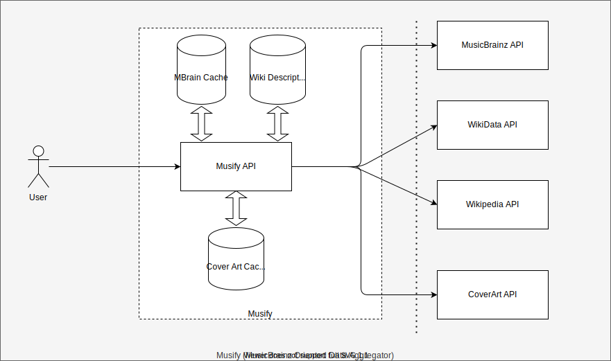

# MusicBrains Based Music Data Aggregator Service

## Solution

This is a microservice to provide comprehensive information related to a music artist.
The information is collected from 4 different sources: MusicBrainz, Wikidata, Wikipedia and Cover Art Archive.

1. MusicBrainz offers an API returning detailed information about music artists e.g. name, birthday, birth country etc.
2. WikiData acts as central storage for the structured data of its Wikimedia sister projects including Wikipedia,
   Wikivoyage, Wiktionary, Wikisource,
   and others.
3. Wikipedia offers an API returning more descriptive information about many different things, one of them are music
   artists.
4. Cover Art Archive is a side-project to MusicBrainz which offers an API finding cover art for albums and singles for a
   specific music artist.

The system consists of one microservice Musify which aggregates information from multiple external services related to a
UUID(MBID) as a request parameter.
This MBID is a primary identifier from MusicBrainz API Service which is then mapped to wiki services and cover api
service to aggregate the final response.



Musify apart from calling the external API also manages an instance cache, which is often synced with the data fetched
from these APIs.

### First Approach

The application was initially implemented with a very basic solution, which sequentially calls all the APIs in order to
fetch data.
Although calling three APIs sequentially is not heavy processing for the Application but `CoverArt API` could become a
bottleneck. The amount request made to `CoverArt API` depends on number of albums from the artist. This may not be a
small number thus application will end up making ~50 request for an artist with 47 albums.

> The response time for this implementation was quite high: 25 to 100 sec.

### Async Concurrent Request

Then the application was improved in order to achieve more requests in parallel, With the help `Async Execution` after
fetching initial response from `MusicBrainz API`. The API requests towards `Wiki APIs` and for all the cover arts
towards `Cover Art API` can be made in parallel.

> The brought down the response time in between 1.5 and 3 Sec

### Cache Implementation

This microservice was mostly doing `HTTP get` request processing, such readonly request are often cached in the services
in order save processing. Normally an application would use a caching service such as `Redis` but here I took a shortcut
and used instance based cache for application from Spring. This also does a very good job.

> This brought down the response time in between 5ms tp 20ms

This was an acceptable the response time for heavy load.

### A Note on Cover API Image Urls

Although the assignment expect to fetch the Image Urls by making respective calls to cover API. It's not really required
in the real world, CoverArt API provides direct re-route to the image by using /front and /back as param, So there not
really a need to
call the API and fetch the link.

But application currently implements calls to cover API.

### Exception Handling

The service has a unified Exception handling. Where all the caught and uncaught exception in the application are
wrapped into `AMusifyBaseException` which in turns defines the response for the user.
Exception is also logged with all the necessary details.

A normal error response has the following model.

```json
{
   "errorUuid": "<uuid>",
   "errorCode": "<Internal Error Code>",
   "message": "<Error Message>"
}
```

Each request can be sent with `X-Correlation-Id` header. This id can be used to trace request in the system, If user
does not provide this correlation id, This will be generated by the application.
Each log in the application contains the correlation id.

### A Note on Bean Validation

I took an assumption that the external APIs will not send an invalid json, So bean validation for response POJOs are
missing. Generally this is also a good practice to have. However, currently if the response is not deserializable then
app throws an exception.

### Testing

It contains a small integration test using `@WebMVC` in spring. More Unit testing can be increased. Although not
implemented here but for component testing I would highly prefer Karate API test. Which can perform end to end test.

### Tools Used

1. IntelliJ for Programming
2. Postman for Testing: [Here the script](./postman/musify.postman_collection.json)
3. JMeter for Performance Testing

### Few UUIDs for testing

```json
{
   "Queen": "0383dadf-2a4e-4d10-a46a-e9e041da8eb3",
   "John Williams": "53b106e7-0cc6-42cc-ac95-ed8d30a3a98e",
   "John Williams 2": "8b8a38a9-a290-4560-84f6-3d4466e8d791",
   "MJ": "f27ec8db-af05-4f36-916e-3d57f91ecf5e"
}
```


